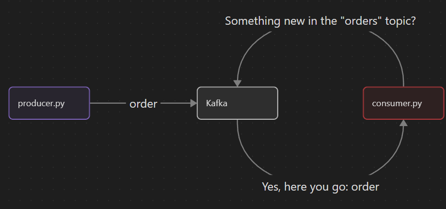

# Kafka

This is a simple project, made to understand the basics of Kafka.

> [Versão em Português do Brasil](docs/README.pt-br.md)

> The project was made using this video as reference: [Kafka Crash Course - Hands-On Project](https://www.youtube.com/watch?v=B7CwU_tNYIE)

## Architecture and Behavior

The project consists in 3 parts:
- A producer
- A Kafka node
- A consumer

Once it's all set up, the data flows like this:
1. The `producer` publishes a food order in Kafka "`orders`" topic, simulating an user interacting with the system;
2. The `consumer` constantly polls the "`orders`" topic in Kafka, searching for new orders;
3. `Kafka` returns the order to the `consumer`;
4. The `consumer` then prints it in the console

As shown by the image below:


## Installing

> You need to have Docker and Python installed

1. Ceate a python `venv`:
```sh
python -m venv .venv
```

2. Activate the `venv` you just created:

Linux:
```sh
source .venv/bin/activate
```

Windows:
```sh
.venv\Scripts\activate
```

3. Install dependencies:
```sh
pip install uv
uv sync
```

## Running the project

1. Run Kafka with the `docker-compose.yaml` file:
```sh
docker compose up -d
```

> For the python commands below, remember to run in a terminal with the `venv` activated

2. Run the `consumer` for it to keep listening:
```sh
python consumer.py
```

3. In another terminal, run the `producer` (it should publish an order, log in the console and exit the program):
```sh
python producer.py
```

> Every single time you run the `producer`, the `consumer` should read the order in `Kafka` and print it in the console