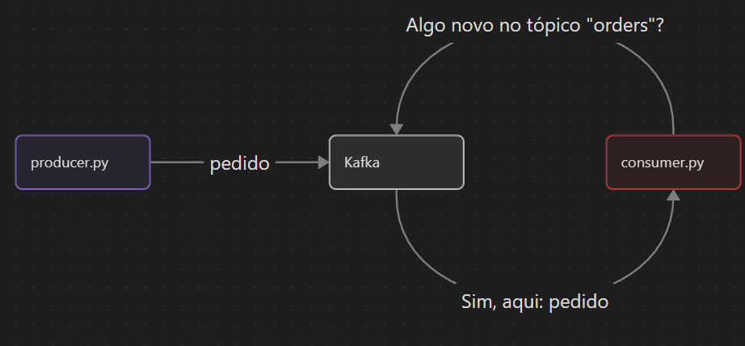

# Kafka

Este é um projeto simples, feito pra entender o básico do Kafka.

> [Version in English](../README.md)

> O projeto foi feito usando esse vídeo como referência: [Kafka Crash Course - Hands-On Project](https://www.youtube.com/watch?v=B7CwU_tNYIE)

## Arquitetura e funcionamento

O projeto consiste em 3 partes:
- Um produtor
- Um nó do Kafka
- Um consumidor

Com tudo configurado, os dados fluem assim:
1. O `produtor` publica um pedido de comida no tópico "`orders`" do Kafka, simulando um usuário interagindo com o sistema;
2. O `consumidor` constantemente procura no tópico "`orders`" do Kafka por novos pedidos;
3. O `Kafka` retorna o pedido para o `consumidor`;
4. O `consumidor` então mostra o pedido no terminal.

Como mostrado na imagem abaixo:


## Instalando

> Você precisa do Docker e do Python instalados

1. Crie uma `venv` do python:
```sh
python -m venv .venv
```

2. Ative a `venv` que você acabou de criar:

Linux:
```sh
source .venv/bin/activate
```

Windows:
```sh
.venv\Scripts\activate
```

3. Instale as dependências
```sh
pip install uv
uv sync
```

## Rodando o projeto

1. Rode o `Kafka` com o arquivo do `docker-compose.yaml`:
```sh
docker compose up -d
```

> Para os comandos de python abaixo, se lembre de rodar em um terminal com a `venv` ativada

2. Rode o `consumidor` pra manter ele ouvindo
```sh
python consumer.py
```

3. Em outro terminal, rode o `produtor` (ele deveria publicar um pedido, printar no terminal e fechar o programa):
```sh
python producer.py
```

> Cada vez que você rodar o `produtor`, o `consumidor` deveria ler o pedido no `Kafka` e printar no terminal